# Fanzone 


### A social media site for football fans

---

### The goal with Fanzone

The goal with Fanzone was to create a simple social media site with the usual
post, comment and like functions but with the twist of being able to support a
specific team to also see a feed with only posts about that certain team.

### Click here to view [Fanzone](https://fanzone-ceb2b022a19f.herokuapp.com/)

---

## Table of contents

1. Project Overview<br/>
   1.1 Structural Planning<br/>
   1.2 Design Ideas<br/>
2. Front-End Documentation<br/>
   2.1 Design Process: UX Desing, mockups and design diagrams<br/>
   2.2 Security Practices: security secret keys etc <br/>
   2.3 Component Usage: use of React components, architecture and component composition<br/>
   2.4 Deployment: How to deploy the Front-End<br/>
   2.5 Coding Standards: JSX, modular component use<br/>
3. Back-End Documentation<br/>
   3.1 API Overview: description of API, functionality and how it integrates with the Front-End<br/>
   3.2 Security Practices: security measures (handling of sensitive data)<br/>
   3.3 Database Design: Structure of database, incl. custom models used<br/>
   3.4 Deployment: How to deploy Back-End<br/>
   3.5 Coding Standards: Python coding standars, adhering to PEP8 guidelines<br/>
4. Testing and Version Control<br/>
   4.1 Manual Testing: testing procedures and results for Front End and Back-End<br/>
   4.2 Version Control: Usage of Git and Githug for version control, incl explanation of commit messages<br/>
   4.3 Remaining errors after testing<br/>
   4.4 Other issues
5. Agile Project Management<br/>
   5.1 User Stories - Front-End
   5.2 User Stories - Back-End
   5.3 Agile Practices - Explanation of other Agile Methodology used
6. Additional Information<br/>
   6.1 Connecting via the terminal
   6.2 Front-End libraries: Justification for the choice of libraries used during the project<br/>
   6.3 Credits: Tutorials or articles used while developing<br/>
   6.4 Licence: Add info about software license if needed<br/>
   6.5 Thanks: add thanks to individuals who have helped or guided during the project<br/>


---

## 1. Project Overview

### 1.1 Structural Planning

The aim of the website was to use a standard modern design using icon to
simplify and with as few pages as possible.
Users can perform the CRUD functions of create, read, update and delete in many
parts of the website.

### 1.2 Design ideas

Initial deas for layout and app title

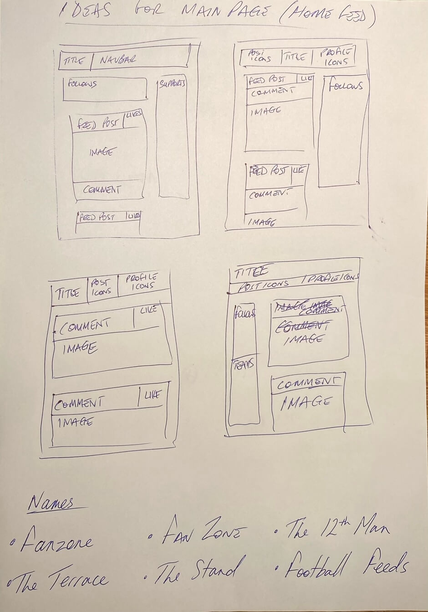

---

## 2. Front-End Documentation

### 2.1 Design Process

**Data Model**

I started from a few drawings of a flowchart and by using the free flowchart
maker from the website [Canva](https://www.canva.com/online-whiteboard/flowcharts/)
the design was set.


**Font and colour schemes**

**Font**

My two main choices of font were:

The Oxygen Mono


and the Open Sans fonts


I chose the Oxygen Mono font as I felt it was simple and clean but a little
relaxed at the same time.

Throughout the app I have used Oxygen Mono as the chosen font and have the
sans-serif as the default backup font.

**Colour**

I chose the colour green as the dominant colour to represent the colour of grass
and so to feel like the background was similar to a football pitch.

There were a few other colours involved during the planning process.

On deciding on the colour green I then chose between a few shades of green.


I chose this shade of green felt energetic. #B5E61D


**Logos, Icons and images**

**Fanzone Logo designed in Microsoft Paint**


The Favicon logo was designed by myself using Microsoft Paint and using a
ball image shrunk down.

I wanted to keep the theme of green and thought the brighter green was energetic
and I felt the logo was more appealing with white text as opposed to black text.

**Fanzone Favicon**


The Favicon was created using [favicon generator](https://favicon.io/favicon-generator/)

The green is the same used in the logo and also with white text.

**FontAwesome Icons used as links**

| Linked command |                                          Icon                                          |
| -------------: | :------------------------------------------------------------------------------------: |
|       **Home** |            |
|    **Sign Up** |    |
|    **Sign In** |    |
|   **Add Post** |         |
|  **Supported** |            |
|      **Likes** |            |
|   **Sign Out** |  |

**Other FontAwesome icons**

|      Linked command |                                        Icon                                        |
| ------------------: | :--------------------------------------------------------------------------------: |
|        **Comments** |  |
|            **Edit** |          |
|     **Change team** |        |
| **Change username** |    |
| **Change password** |            |
|          **Search** |      |

#### 2.2 Security Practices: security secret keys etc

The following methods were used to raise security through the front end:

- "allauth" authentication and authorization is used for inlogging and storing information via the admin portal
- CORS allowed via Client Origin link, also saved in the env.py file

#### 2.3 Component Usage: use of React components, architecture and component composition

There are 5 reusable components in Fanzone:

| Component       | What it does                                                                                                         | Times used |
| --------------- | -------------------------------------------------------------------------------------------------------------------- | ---------- |
| Asset.js        | It is used mostly for the loading spinner but can be used for other image files                                      | 6          |
| Avatar.js       | The users profile image which is used when posting, commenting, following and on own profile                         | 5          |
| MoreDropdown.js | To call the "three dots" editing/deleting function. Used on posts/comments and also profile editing                  | 3          |
| NavBar.js       | Used for the main NavBar and contains the icons and their links                                                      | 1          |
| PageNotFound.js | A replacement of the 404 file, this page is connected to the App.js file and is used when a wrong address is entered | 1          |


#### 2.4 Deployment: How to deploy the Front-End

**Steps to deploy in Github**

To deploy in Github, you'll need to do the following things once logged in:

- Create a repository
- Click on Settings
- Click on Pages

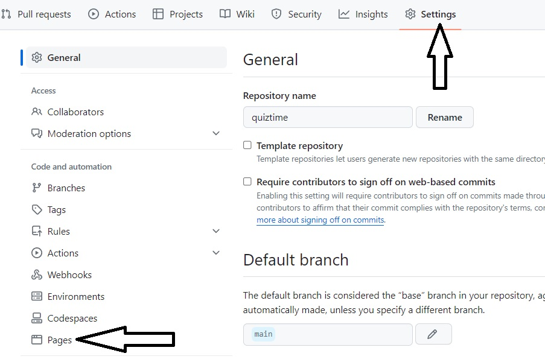

- Under Source, select "Deploy from a branch"

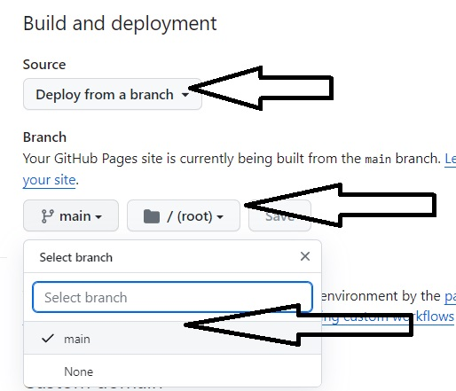

- Under Branch, make sure your branch is set to "main" and then that the "/(root)" is selected
- Save

**Steps to deploy in Heroku**

To deploy in Heroku, you'll need to do the following things once logged in:

- Click on the "New" icon on the right-hand side of the page
- Choose "Create new app"

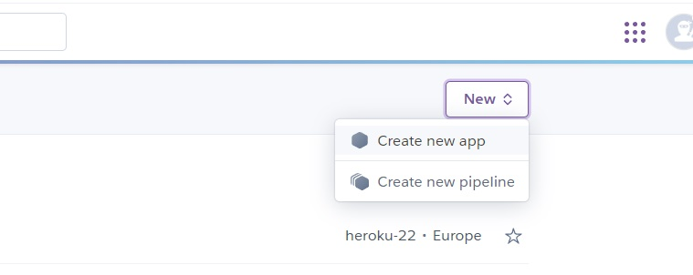

- Enter a name for your app
- Choose your region (USA or Europe)
- Click on "Create app"

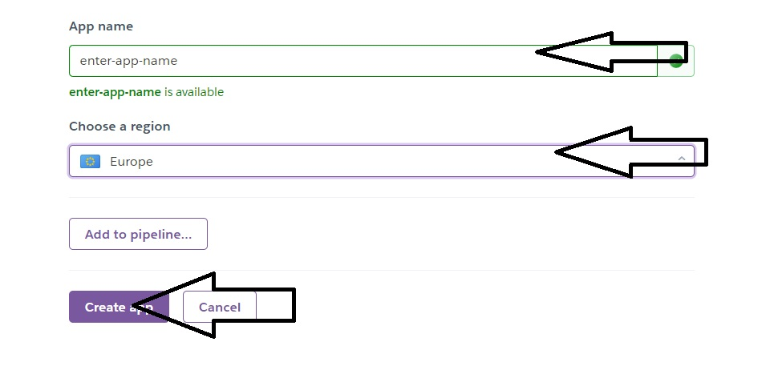

- Click to go to Settings
- Click to open the Config Vars

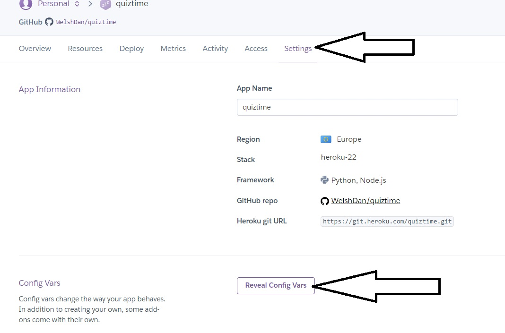

  Add your specific config vars here:

- ALLOWED_HOST
- CLIENT_ORIGIN
- CLOUDINARY_URL
- DATABASE_URL
- DEBUG (only used during development)
- DISABLE_COLLECTSTAIC (only used during development)
- POSTRESQL_DB
- POSTGRESQL_ENGINE
- SECRET_KEY

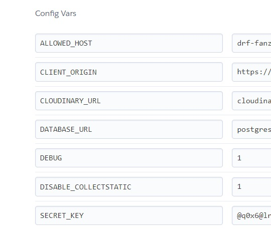

The final part to the deployment is to connect your Heroku app to Github:

- Click on the Deploy tab
- Select the "Deploy to Github" option in the middle
- Make sure it is connected as shown in this final image

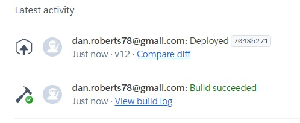

Further information can be found on the Heroku site [here](https://devcenter.heroku.com/articles/git)

#### 2.5 Coding Standards: JSX, modular component use

**What is JSX?**

The website [geeksforgeeks.org]('https://www.geeksforgeeks.org/reactjs-jsx-introduction/') describes JSX as the following:</br>
"React JS JSX is a syntax extension of JavaScript for writing React Code in a simple way. Using JSX it is easier to create reusable UI components with fewer lines of code in a template-type language with the power of JavaScript."

**Examples of JSX in Fanzone**

Below is a good example of JSX code in Fanzone. We see a functional component called Avatar. React is imported as is the css created for this function called Avatar.module.css.

This function renders a ```<span>``` element with the parameters of the Avatar's image. ```export default Avatar;``` means that this function can then be imported into other parts of the code.

```
import React from 'react'
import styles from "../styles/Avatar.module.css"

const Avatar = ({ src, height = 45, text }) => {
    return (
        <span>
            
            {text}
        </span>
    );
};

export default Avatar;
```
The benefits to using JSX include:

- Enables users to build interfaces in a more intuitive and recognisable way.
- Interfaces can be influenced directly instead of using the DOM directly.
- Users familiar to JavaScript can use their knowledge and create more complex interfaces.
- JSX is important to React, so learning JSX will allow for greater usage of React.

---

## 3. Back-End Documentation

#### 3.1 API Overview: description of API, functionality and how it integrates with the Front-End

The API uses a few different databases to fascilitate the needs of the website:

- Cloudinary receives images uploaded as either profile images or post images, as well as stores static files contained on the workspace. There are many ```src``` links that connect to the image database of Cloudinary.
- ElephantSQL stores the database information about parts such as profiles, posts and supported teams.

The connections from the API and it's databases through the Front-End is largely integrated either through direct code or through the models.py files of the apps. These models.py files can be found in the following apps.

Using the GET method, the API connects through the following url patterns:

```
admin/
api/api-auth/
api/dj-rest-auth/logout/
api/dj-rest-auth/
api/dj-rest-auth/registration/
api/ profiles/
api/ profiles/<int:pk>/
api/ posts/
api/ posts/<int:pk>/
api/ comments/
api/ comments/<int:pk>/
api/ likes/
api/ likes/<int:pk>/
api/ followers/
api/ followers/<int:pk>/
api/ supported/
api/ supported/<int:pk>/
```

#### 3.2 Security Practices: security measures (handling of sensitive data)

To protect sensitive information, such as secret keys, an env.py file was created and this held sensitive information connected to the settings file using os.environ:

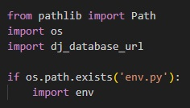

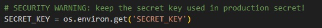

In env.py:

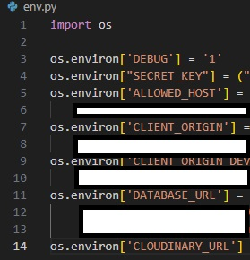

#### 3.3 Database Design: Structure of database, incl. custom models used

The custom model used was the Supported model. This is used in both Post creation and also in the Profile of each user. A user can choose their favourite team from a list of teams and then if their chosen team matches the selected team in the posts, then they will appear in the user's Supported Feed.

#### 3.4 Deployment: How to deploy Back-End

**Steps to deploy in Github**

This is identical to the Front-End deployment, except the title of the repository should be similar to the Front-End title but include "drf" in the title. For example, "project" = Front-End and "drf-project" for Back-End.

**Cloudinary**

Create an account and then click on "Dashboard" to access the following page:

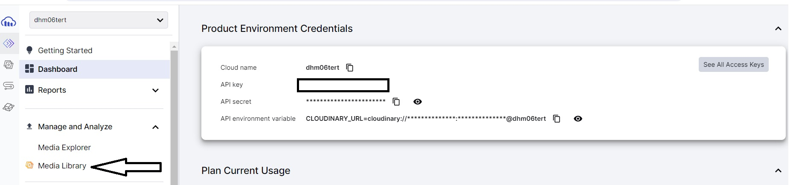

Your API env variable will be important to add to your Heroku config vars and your env file. Then click "Media Library" to go to the images.

In the Media Library there are the following links:

- "Home": Your start page
- "Assets": Contains all uploaded images
- "Folders": Contains uploaded images sorted into folders

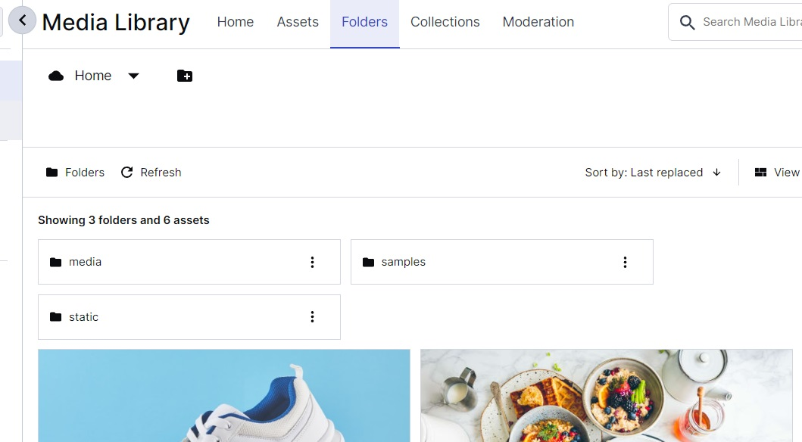

**DRF - Django Rest Framework**

To initiate the DRF, in the python terminal, enter:

```
pip3 install 'django<4'
```

Then to start your project (if your project was named "Fanzone" for example), enter:

```
django-admin startproject drf-fanzone
```

Then to connect your project to Cloudinary, you'll need to enter:

```
pip install django-cloudinary-storage
```

Then to enable a library that provides image processing in the project, "Pillow" needs to be added:

```
pip install Pillow
```

**ElephantSQL creation**

Once you have logged in, the following steps need to be taken:
- Create a "new instance"
- Name the instance after your drf prject name (e.g. drf-fanzone)
- Keep to the Tiny Turtle (free) plan
- Select Europe as your region, if you are in Europe
- Click "Create ElephantSQL" to create your instance
- Once created, you will get a connection string. This string should be added to both your Heroku config vars and your env.py file

Link to the creation of the ElephantSQL database can be found [here](https://www.elephantsql.com/docs/index.html)

#### 3.5 Coding Standards: Python coding standards, adhering to PEP8 guidelines

I have tried to follow the guidelines as explained in this simple table from [Real Python](https://realpython.com/python-pep8/)

| Type     | Naming Convention                                                                                                                                                                                                     | Examples                                        |
| -------- | --------------------------------------------------------------------------------------------------------------------------------------------------------------------------------------------------------------------- | ----------------------------------------------- |
| Function | Use a lowercase word or words. Separate words by underscores to improve readability.                                                                                                                                  | function, python_function                       |
| Variable | Use a lowercase single letter, word, or words. Separate words with underscores to improve readability.                                                                                                                | x, var, python_variable                         |
| Class    | Start each word with a capital letter. Don’t separate words with underscores. This style is called [camel case](https://en.wikipedia.org/wiki/Camel_case) or [Pascal case](https://en.wikipedia.org/wiki/Camel_case). | Model, PythonClass                              |
| Method   | Use a lowercase word or words. Separate words with underscores to improve readability.                                                                                                                                | class_method, method                            |
| Constant | Use an uppercase single letter, word, or words. Separate words with underscores to improve readability.                                                                                                               | CONSTANT, PYTHON_CONSTANT, PYTHON_LONG_CONSTANT |
| Module   | Use a short, lowercase word or words. Separate words with underscores to improve readability.                                                                                                                         | module.py, python_module.py                     |
| Package  | Use a short, lowercase word or words. Don’t separate words with underscores.                                                                                                                                          | package, pythonpackage                          |

---

## 4. Testing and Version Control

#### 4.1 Manual Testing: testing procedures and results for Front End and Back-End

|    | Back/Front? | Area           | Test                                                                          | Expected Result                                                        | Pass? | Notes                                                |
| -- | ----------- | -------------- | ----------------------------------------------------------------------------- | ---------------------------------------------------------------------- | ----- | ---------------------------------------------------- |
| 1  | Front       | NavBar         | Clicking "sign in" icon                                                       | Links to "sign in" page                                                | Yes   |                                                      |
| 2  | Front       | NavBar         | Clicking "sign up" icon                                                       | Links to "sign up" page                                                | Yes   |                                                      |
| 3  | Front       | Sign In page   | Not filling in username and/or password details and clicking "sign in" button | Returns an error message                                               | Yes   |                                                      |
| 4  | Front       | Sign In page   | Entering incorrect details and clicking "sign in" button                      | Returns an error message                                               | Yes   |                                                      |
| 5  | Front       | Sign In page   | Entering correct details and clicking "sign in" button                        | Log in successful, link to "Home" feed                                 | Yes   |                                                      |
| 6  | Front       | NavBar         | Clicking Add Post button                                                      | Links to "Add Post" page                                               | Yes   |                                                      |
| 7  | Front       | NavBar         | Clicking Supported button                                                     | Links to "Supported" page                                              | Yes   |                                                      |
| 8  | Front       | NavBar         | Clicking Likes button                                                         | Links to "Likes" page                                                  | Yes   |                                                      |
| 9  | Front       | NavBar         | Clicking Profile picture or username buttons                                  | Links to users "Profile" page                                          | Yes   |                                                      |
| 10 | Front       | NavBar         | Clicking "sign out" icon                                                      | Logs out user/links to "sign up" page                                  | No    | User remains in home feed though they cannot comment |
| 11 | Front       | Add Post       | Not entering a title or a content and then clicking create                    | Returns an error message                                               | Yes   |                                                      |
| 12 | Front       | Add Post       | Not entering a title or a content and then clicking clear                     | Returns to previous page                                               | Yes   |                                                      |
| 13 | Front       | Add Post       | Choosing too large a size file                                                | Returns an error message                                               | Yes   |                                                      |
| 14 | Front       | Add Post       | Adding correct details in post and pressing "create"                          | Creates post/ user links to feed                                       | Yes   |                                                      |
| 15 | Front       | Add Post       | After posting, avatar image, title, content are all shown                     | Avatar image, title, content created                                   | No    | Avatar image is not shown                            |
| 16 | Front       | Feed           | Click on users avatar under "Most followed profiles"                          | Links to user's profile page                                           | Yes   |                                                      |
| 17 | Front       | Feed           | Click on follow a profile                                                     | Button changes to unfollow<br>User's profile adds 1 to "following"     | Yes   |                                                      |
| 18 | Front       | Feed           | Click to unfollow a profile                                                   | Button changes to follow<br>User's profile reduces by 1 to "following" | Yes   |                                                      |
| 19 | Front       | Feed           | Click on another user's post's avatar                                         | Takes user to the other urer's profile                                 | Yes   |                                                      |
| 20 | Front       | Feed           | Click on another user's post's name, image or content of post                 | Take user to post                                                      | Yes   |                                                      |
| 21 | Front       | Feed           | Click on ball (like)                                                          | Adds 1 to the number of likes for that post                            | Yes   |                                                      |
| 22 | Front       | Feed           | Click on ball (like) again                                                    | Takes away 1 to the number of likes for that post                      | Yes   |                                                      |
| 23 | Front       | Feed           | Click on speech bubble (comment)                                              | Opens post and comment content                                         | Yes   |                                                      |
| 24 | Front       | Feed           | User can delete own posts                                                     | "Three dots" are visible                                               | No    | Option to edit or delete post not available          |
| 25 | Front       | Feed           | Scroll down                                                                   | Infinite feed activates and user can scroll to bottom                  | Yes   |                                                      |
| 26 | Front       | Profile        | On opening profile                                                            | User can see all his posts and user stats                              | Yes   |                                                      |
| 27 | Front       | Profile        | User can delete own posts                                                     | "Three dots" are visible                                               | No    | Option to edit or delete post not available          |
| 28 | Front       | Profile        | User can edit profile info                                                    | Clicking on edit profile links to edit profile page                    | Yes   |                                                      |
| 29 | Front       | Profile        | User can change username                                                      | Clicking on edit profile links to edit username page                   | Yes   |                                                      |
| 30 | Front       | Profile        | User can change password                                                      | Clicking on edit profile links to edit password page                   | Yes   |                                                      |
| 31 | Front       | Home Feed      | User can see all posts                                                        | All posts should be available to the user                              | Yes   |                                                      |
| 32 | Front       | Supported Feed | User can see posts of supported teams                                         | Only those posts should be shown                                       | No    | All posts are shown                                  |
| 33 | Front       | Liked Feed     | User can see posts that he has liked or commented on                          | Only those posts should be shown                                       | No    | All posts are shown                                  |

Backend tests that were run include:

- Tests can list posts
- Test if user can create a post
- Test if pages can be accessed when logged out
- Test if user can see a post using post id
- Test if user can see a post with an invalid id
- User can see own posts
- User cannot update a post that isn't their own
  
And also the localhost: 8000 (API for DRF), was checked for the following things:

- Posts, Profiles, Users, contain correct information against the models.py file
- Profiles were created correctly
- Posts were created correctly


#### 4.2 Version Control: Usage of Git and Githug for version control, incl explanation of commit messages

#### 4.3 Remaining errors after testing

There are a few errors and bugs remaining:

- The profile avatar is not connecting in posts and show only a broken image icon
- On logging out, the home feed is still shown. Users cannot however comment on posts
- Automatic tests were not added to all functions
- Error messages are the default messages

Testing results:

|    | Back/Front? | Area           | Test                                                      | Expected Result                       | Pass? | Notes                                                |
| -- | ----------- | -------------- | --------------------------------------------------------- | ------------------------------------- | ----- | ---------------------------------------------------- |
| 10 | Front       | NavBar         | Clicking "sign out" icon                                  | Logs out user/links to "sign up" page | No    | User remains in home feed though they cannot comment |
| 15 | Front       | Add Post       | After posting, avatar image, title, content are all shown | Avatar image, title, content created  | No    | Avatar image is not shown                            |
| 24 | Front       | Feed           | User can delete own posts                                 | "Three dots" are visible              | No    | Option to edit or delete post not available          |
| 27 | Front       | Profile        | User can delete own posts                                 | "Three dots" are visible              | No    | Option to edit or delete post not available          |
| 32 | Front       | Supported Feed | User can see posts of supported teams                     | Only those posts should be shown      | No    | All posts are shown                                  |
| 33 | Front       | Liked Feed     | User can see posts that he has liked or commented on      | Only those posts should be shown      | No    | All posts are shown                                  |

#### 4.4 Other issues and information

**Test Profiles**

Admin

- admin / admin12345
- TestUser1 - TestPassword1

Users

- Alan / AlanPassword
- Phil / PhilPassword
- TaraTaylor / TaraPassword1
- Sam / SamPassword
- Sally / SallyPassword
- 

---

## 5. Agile Project Management

#### 5.1 User Stories - Front-End

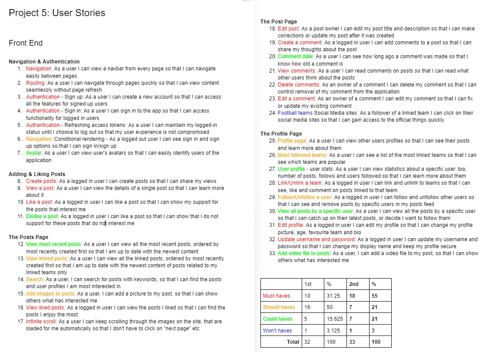

#### 5.2 User Stories - Back-End

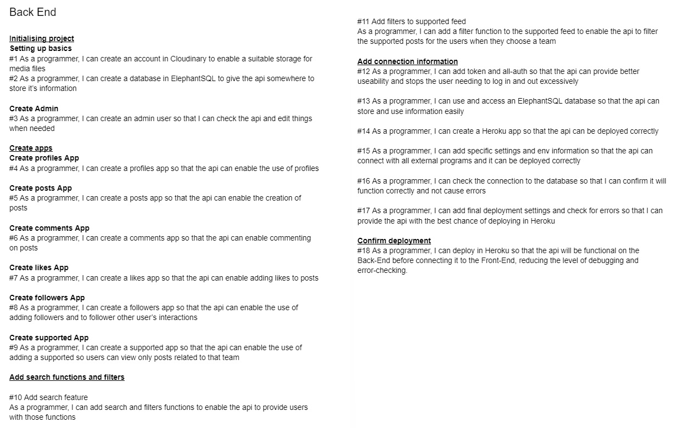

#### 5.3 Agile Practices - Explanation of other Agile Methodology used

Github "Milestones

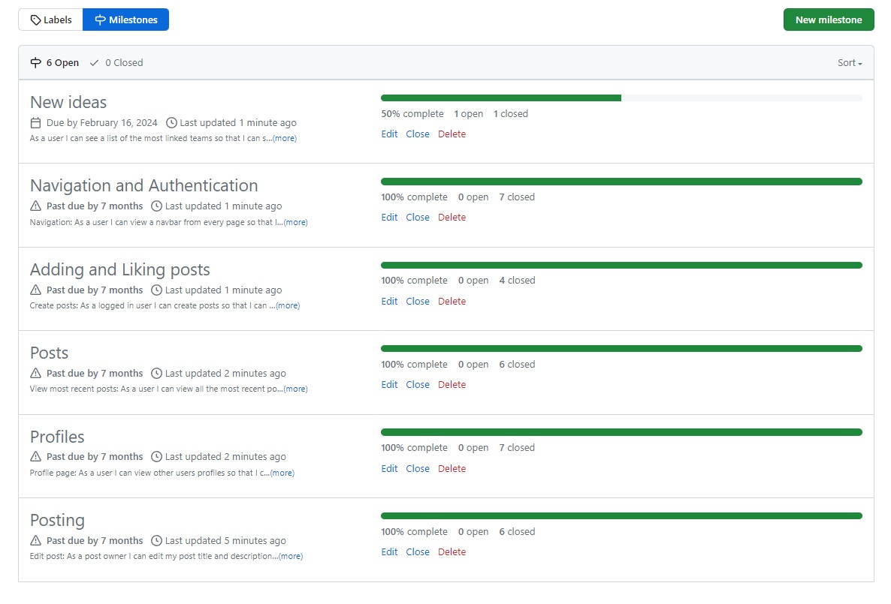

---

## 6. Additional Information

#### 6.1 Connecting via the terminal

Starting the app required two terminals open (I chose a split terminal)

1. Starting Django from the backend
2. Starting React js from the frontend.

To start the app, I started with these codes in terminal 1:

First the Back-End in terminal 1:

```
python manage.py runserver
```

Then the Front-End in terminal 2:

Change directory to Fanzone/frontend

```
cd frontend
```

Then to start React and open the webpage in a browser:

```
npm start
```

The website was then run using Port: 3000 which is the connected to the
frontend. While I could connect to the DRF part of the API by using Port: 8000

#### 6.2 Front-End libraries: Justification for the choice of libraries used during the project

ReactJS - There are many reasons why this is perfect for my project:

- It has many repeatable parts
- Easy and "clean" for a user to use
- Becomes powerful when used with Django REST Framework
- Easy to connect to Cloudinary

#### 6.3 Credits: Tutorials or articles used while developing

The following sources have been used to provide either a direct influence or
as a source of inspiration:

- The lessons, tutorials and course literature of Code Institute's Advanced
  Front End section, particularly including the 'Moments' and Django REST
  Framework modules.

- [Guide for models for Supported posts](https://docs.djangoproject.com/en/5.0/ref/models/fields/)
- Pep8 information: [Real Python](https://realpython.com/python-pep8/)
- Information about JSX: [geeksforgeeks.org](https://www.geeksforgeeks.org/reactjs-jsx-introduction/)
- More information about JSX: [kinsta.com](https://kinsta.com/knowledgebase/what-is-jsx/#:~:text=Here's%20a%20simple%20example%20of,element%20with%20a%20greeting%20message.)

#### 6.4 License: Add info about software license if needed

Thanks to the following image creators for their free images:

From pixabay.com:

- jplenio
- Pexels
- Bessi
- artsysolomon
- Leroy_Skalstad
- Engin_Akyurt
- planet_fox
- 134213
- Ralphs_Fotos
- qimono
- Mohamed_hassan
- StartupStockPhotos

From freepix.com:

- master1305
- Freepik
- rawpixel.com

#### 6.5 Thanks: add thanks to individuals who have helped or guided during the project

The following sources have been directly involved in helping to solve problems
issues with the development of Fanzone:

- Tutor Support provided by Code Institute
- My Mentor Akshat Garg
- Slack, the business messaging app, and its users, for help with issues
  including lines too long errors and cookie refresh errors
- Keith Herne
- Abhi Shek
