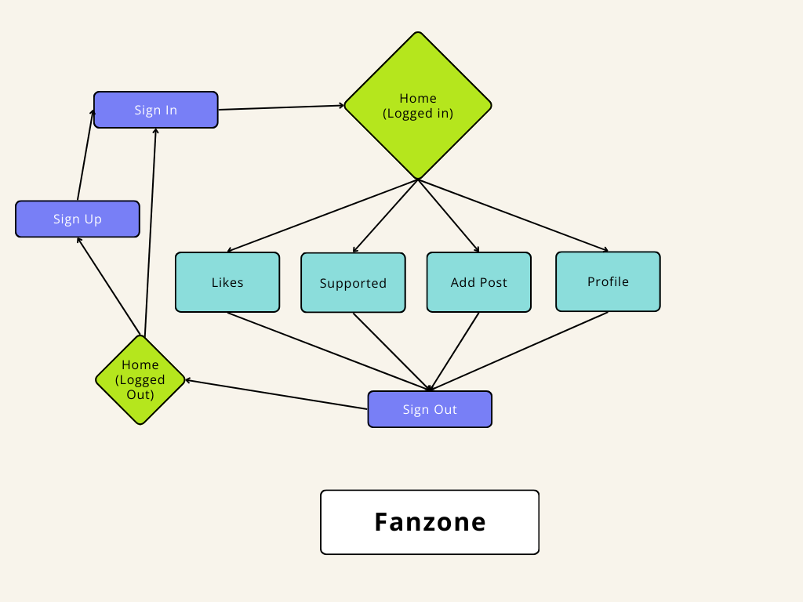
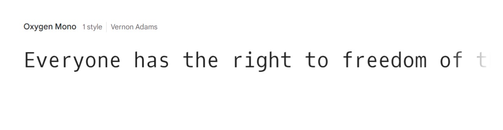
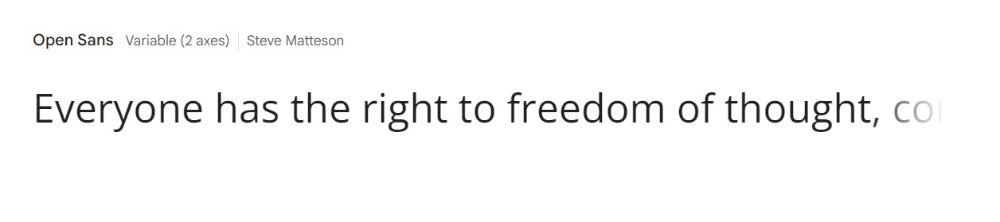
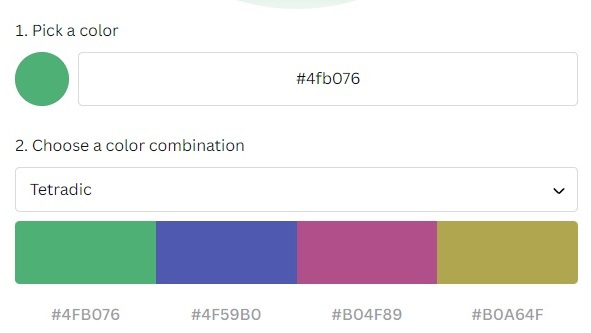
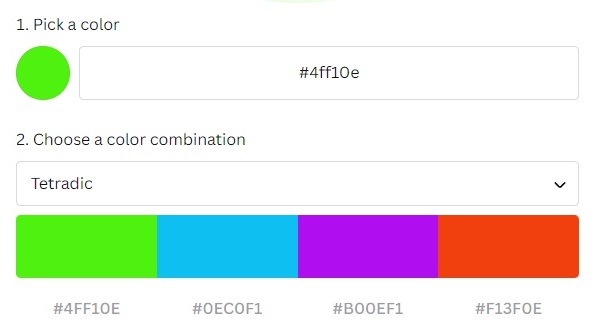
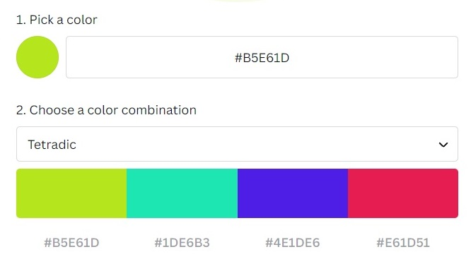

# Fanzone 


### A social media site for football fans

---

### The goal with Fanzone

The goal with Fanzone was to create a simple social media site with the usual
post, comment and like functions but with the twist of being able to support a
specific team to also see a feed with only posts about that certain team.

### Click here to view [Fanzone](https://fanzone-ceb2b022a19f.herokuapp.com/)

---

## Table of contents

1. Planning
2. App Layout
3. Used Technologies
4. Installation
5. Usage
6. Testing issues
   Testing
   Bugs
7. Problems and incompletions
8. Credits

---

## 1. Planning

### Functionality

The aim of the website was to use a standard modern design using icon to
simplify and with as few pages as possible.
Users can perform the CRUD functions of create, read, update and delete in many
parts of the website.

### User Stories

There were 33 User Stories in total:

- 25 were completed
- 2 were removed from the planning
- 3 remain incomplete
- 3 were removed due to time constraints (see section 7)


---

## 2. App Layout

### Design

#### Data Model

I started from a few drawings of a flowchart and by using the free flowchart
maker from the website [Canva](https://www.canva.com/online-whiteboard/flowcharts/)
the design was set.



### Icons and images

Fanzone Icon designed in Microsoft Paint:


### Font and colour schemes

#### Font

My two main choices of font were:

The Oxygen Mono



and the Open Sans fonts



I chose the Oxygen Mono font as I felt it was simple and clean but a little
relaxed at the same time.

Throughout the app I have used Oxygen Mono as the chosen font and have the
sans-serif as the default backup font.

#### Colour

I chose the colour green as the dominant colour to represent the colour of grass
and so to feel like the background was similar to a football pitch.

There were a few other colours involved during the planning process.

On deciding on the colour green I then chose between a few shades of green.





I chose this shade of green felt energetic. #B5E61D



#### Fanzone Logo


The Favicon logo was designed by myself using Microsoft Paint and using a
ball image shrunk down.

I wanted to keep the theme of green and thought the brighter green was energetic
and I felt the logo was more appealing with white text as opposed to black text.

#### Fanzone Favicon


The Favicon was created using [favicon generator](https://favicon.io/favicon-generator/)

The green is the same used in the logo and also with white text.

#### FontAwesome Icons used as links

| Linked command |                                          Icon                                          |
| -------------: | :------------------------------------------------------------------------------------: |
|       **Home** |            |
|    **Sign Up** |    |
|    **Sign In** |    |
|   **Add Post** |         |
|  **Supported** |            |
|      **Likes** |            |
|   **Sign Out** |  |

#### Other FontAwesome icons

|      Linked command |                                        Icon                                        |
| ------------------: | :--------------------------------------------------------------------------------: |
|        **Comments** |  |
|            **Edit** |          |
| **Change username** |    |
| **Change password** |            |
|          **Search** |      |

---

## 3. Used Technologies

Fanzone was created using:

- Django REST Framework
- ReactJs
- Codeanywhere IDE

With support from:

- Heroku
- Cloudinary

---

## 4. Installation

#### Dependencies

Frontend

```
npm install
ES7 React/Redux/GraphQl/React-Native - (snippets) by dsznajder
npm install react-bootstrap@1.6.3 bootstrap@4.6.0
npm install axios
npm install react_infinite-scroll-component
npm install msw –save-dev (for mock API for testing)
npm install jwt-decode (to decode json webtokens)
```

Backend

```
pip3 install 'django<4'
django-admin startproject drf_fanzone .
pip install django-cloudinary-storage
Pip install Pillow
Pip install djangorestframework
Pip install django-filter
pip3 install dj-rest-auth==2.1.9 (For JSON web tokens)
pip install ‘dj-rest-auth[with_social]’
pip install djangorestframework-simplejwt
pip3 install dj_database_url==0.5.0 psycopg2
pip3 install gunicorn django-cors-headers
```

---

## 5. Usage

Starting of the app required two terminals open

1. Starting Django from the backend
2. Starting React js from the frontend.

To start the app, I started with these codes in terminal 1:

To change directory to Fanzone/frontend

`cd frontend`

Then to start React

`npm start`

Then to start Django in terminal 1:

`python manage.py runserver`

The website was then run using Port: 3000 which is the connected to the
frontend.

#### Test Profiles

**Admin**

- admin / admin12345
- TestUser1 - TestPassword1

**Users**

- Alan / AlanPassword
- Phil / PhilPassword
- TaraTaylor / TaraTaylor1
- Sam / SamPassword

---

## 6. Testing Issues

There was an issue with the backend at one point and so there were parts of the
testing which remain incomplete. I also had to restart my workspace the day
before submission which helped to create some gremlins in the system.

Backend tests that were run include:

- Tests can list posts
- Test if user can create a post
- Test if pages can be accessed when logged out
- Test if user can see a post using post id
- Test if user can see a post with an invalid id
- User can see own posts
- User cannot update a post that isn't their own

---

## Problems and incompletions

#### Problems

The website is slow and there are many styling issues. The website is has not
been checked using lighthouse, for its code or its layout.

#### Incompletions

There is a major part of this website that isn't complete.
The supported teams function is not complete and is only partially complete in
the code.

The README.md file is not complete and lacks extensive information on testing,
website layout and descriptions, as well as how the website operates.

---

## 8. Credits, Help and Copyright

### Credits

The following sources have been used to provide either a direct influence or
as a source of inspiration:

- The lessons, tutorials and course literature of Code Institute's Advanced
  Front End section, particularly including the 'Moments' and Django REST
  Framework modules.

[404 page - PedroTech](https://www.youtube.com/watch?v=9AZghsVgNvs)
[websocket problems](https://github.com/facebook/create-react-app/issues/11779)

### Help

The following sources have been directly involved in helping to solve problems
issues with the development of Fanzone:

- Tutor Support provided by Code Institute
- My Mentor Akshat Garg
- Slack, the business messaging app, and its users, for help with issues
  including lines too long errors and cookie refresh errors
- React documentation and tutorials
- React bootstrap documentation and tutorials

### Copyright

Thanks to the following image creators for their free images:

From pixabay.com:

- jplenio
- Pexels
- Bessi
- artsysolomon
- Leroy_Skalstad
- Engin_Akyurt
- planet_fox
- 134213
- Ralphs_Fotos
- qimono
- Mohamed_hassan

From freepix.com:

- master1305
- Freepik
- rawpixel.com

---

Problems 6/2
Bad Request: /api/dj-rest-auth/login/
[06/Feb/2024 14:46:10] "POST /api/dj-rest-auth/login/ HTTP/1.1" 400 68
[solution](https://stackoverflow.com/questions/62592113/fetching-user-details-in-react-from-django-rest-auth-gives-back-403-forbidden)
